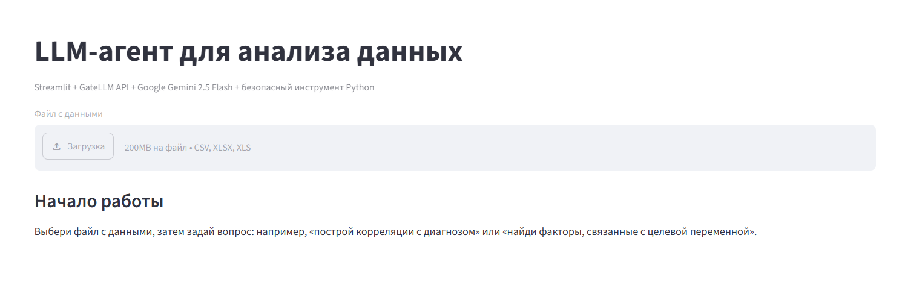
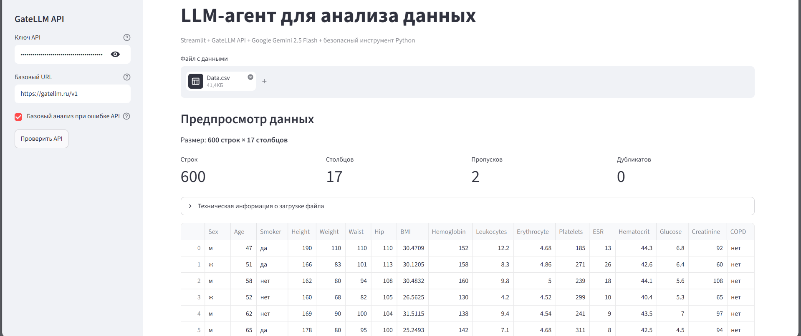
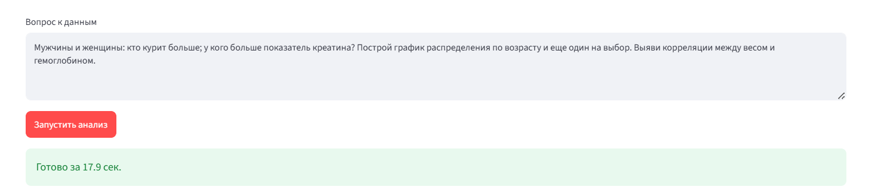
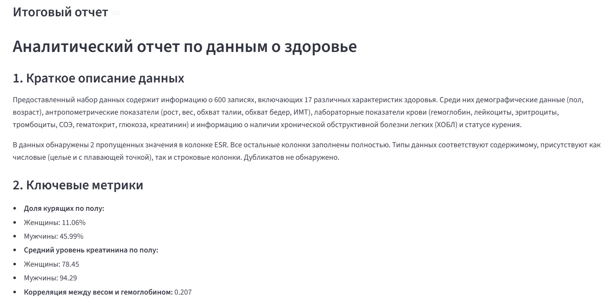
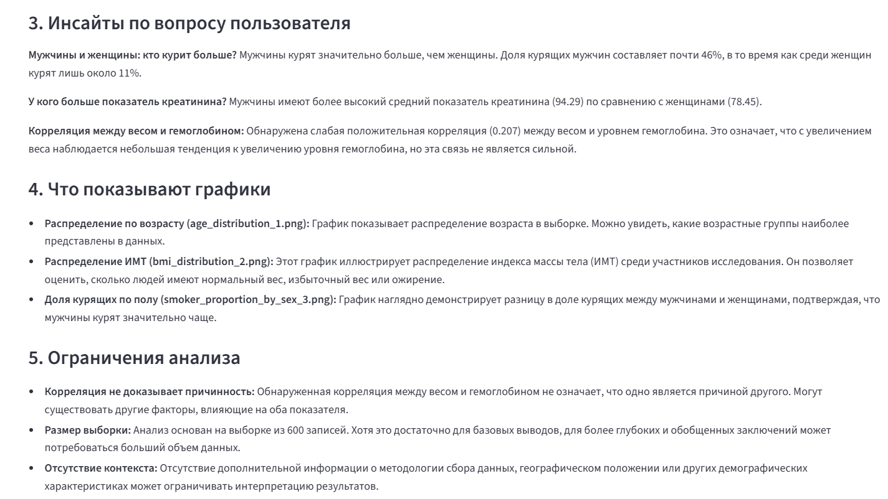
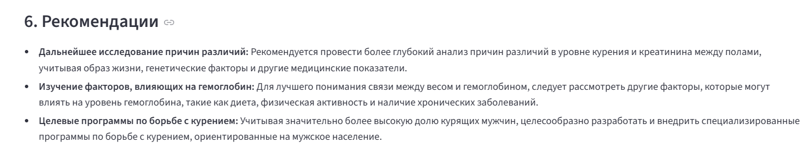
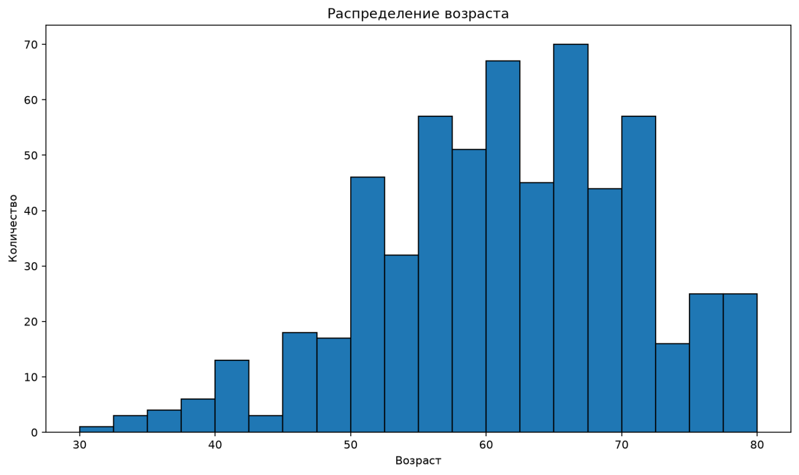
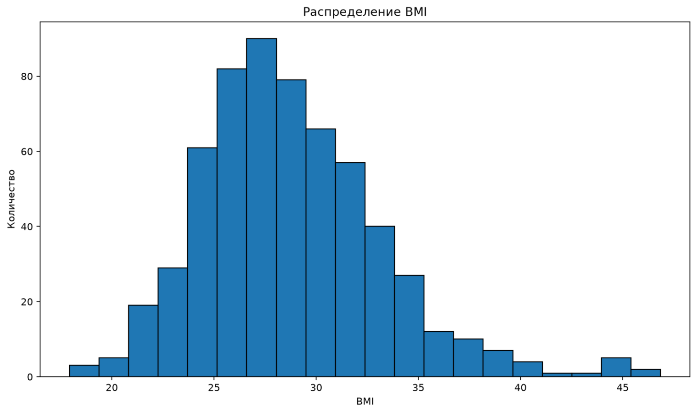
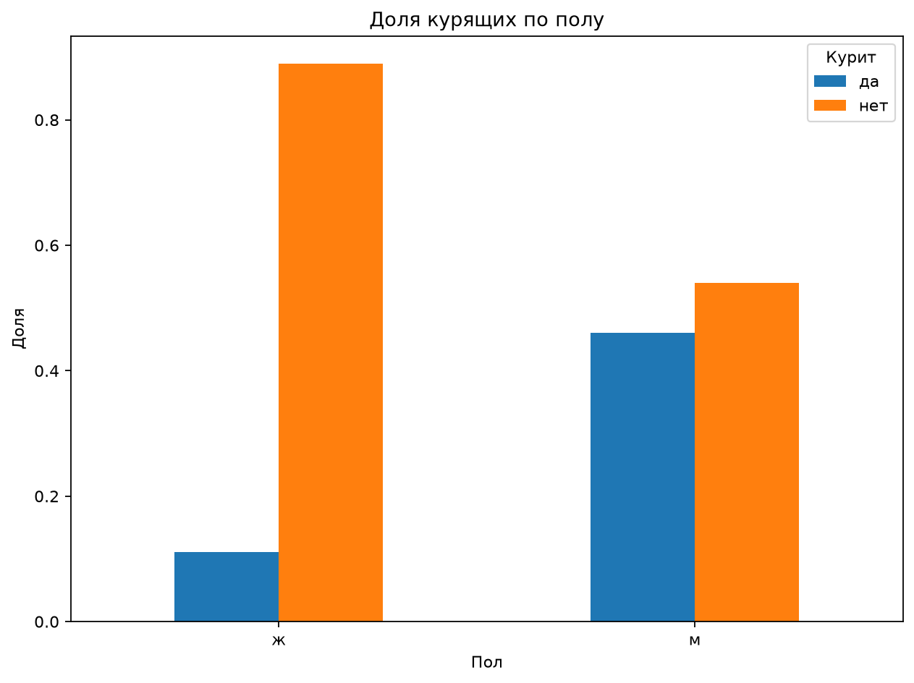

# Задание 3 — LLM-аналитик данных

Веб-приложение на Streamlit для анализа пользовательских датасетов с помощью LLM-агента.

Пользователь загружает CSV/XLSX-файл, пишет вопрос или инструкцию, после чего агент анализирует данные, строит графики и формирует отчет.

## Стек

- Python
- Streamlit
- Pandas
- Matplotlib
- GateLLM API
- Google Gemini 2.5 Flash

## Что умеет приложение

- загружать CSV и Excel-файлы;
- показывать краткую информацию о датасете;
- принимать пользовательский вопрос к данным;
- запускать LLM-агента;
- выполнять Python-код, сгенерированный LLM, через безопасный tool;
- строить графики;
- формировать итоговый аналитический отчет.

## Агентная логика

LLM не получает заранее готовый анализ.  
Она сама определяет, какой Python-код нужно выполнить для исследования датасета.

Схема работы:

```text
Пользователь загружает датасет
↓
Пользователь задает вопрос
↓
LLM составляет Python tool call
↓
Приложение безопасно выполняет код над df
↓
LLM получает результат выполнения
↓
LLM формирует отчет
```

## Используемая модель

В проекте используется модель:

```text
google/gemini-2.5-flash
```

API вызывается через GateLLM:

```text
https://gatellm.ru/v1
```

## Защита

В проекте есть базовая защита от prompt-injection и опасного Python-кода.

Запрещены операции вроде:

- чтение и запись файлов;
- системные команды;
- сетевые запросы;
- `eval`;
- `exec`;
- `open`;
- импорт опасных библиотек.

## Установка

```bash
python -m venv .venv
.venv\Scripts\Activate.ps1
pip install -r requirements.txt
```

## Настройка API-ключа

Создайте файл `.env` в корне проекта:

```env
GATELLM_API_KEY=ваш_api_ключ
GATELLM_BASE_URL=https://gatellm.ru/v1
```

Файл `.env` нельзя загружать в GitHub.

## Запуск

```bash
streamlit run app.py
```

После запуска приложение откроется в браузере.

## Структура проекта

```text
app.py          — Streamlit-интерфейс
agent.py        — логика LLM-агента
llm_client.py   — подключение к GateLLM API
tools.py        — безопасное выполнение Python-кода
data_loader.py  — загрузка CSV/XLSX
security.py     — проверки безопасности
requirements.txt
README.md
.env
.gitignore
images/
```

## Пример работы

### Интерфейс



### Загруженные данные




### Пример ответа






### Примеры графиков





